# 🚀 DevOps CI/CD Pipeline with Jenkins, Docker & AWS EC2

---

## 📌 Project Description

This project demonstrates an end-to-end **CI/CD pipeline** to build, push, and deploy a containerized static web application using **Jenkins automation**.
The application is deployed on **AWS EC2 using Docker Compose** and monitored using **Uptime Kuma with alert notifications**.

---

## 🧰 Tech Stack

* Jenkins
* Docker
* DockerHub
* AWS EC2 (Ubuntu)
* Nginx
* GitHub
* Uptime Kuma (Monitoring & Alerts)

---

## 🔄 CI/CD Pipeline Flow

### 🔹 Source Stage

* Code is pushed to GitHub (dev/main branches)

### 🔹 Build Stage (Jenkins)

* Jenkins pulls code from GitHub
* Builds Docker image using Dockerfile
* Uses Nginx to serve static files

### 🔹 Push Stage

* Authenticates with DockerHub
* Pushes image to:

  * `dev` repo (for dev branch)
  * `prod` repo (for main branch)

### 🔹 Deploy Stage

* Uses `docker-compose` on EC2
* Pulls latest image
* Runs container on port **80**

---

## 🏗️ Architecture

```
GitHub → Jenkins → Docker → DockerHub → AWS EC2 → Browser
                                      ↓
                                  Uptime Kuma
```

---

## ⚙️ Setup Instructions

### 1️⃣ Launch EC2 Instance

* Instance type: `m7i-flex.large`
* OS: Ubuntu
* Open ports:

  * 80 (HTTP) (Prod)
  * 9000 (HTTP) (dev)
  * 22 (SSH)
  * 3001 (Uptime Kuma)

---

### 2️⃣ Install Required Tools

```bash
sudo apt update
sudo apt install docker.io docker-compose -y
sudo systemctl start docker
sudo usermod -aG docker ubuntu
```

---

### 3️⃣ Build & Push Docker Image

```bash
docker build -t jagadishhak/dev .
docker push jagadishhak/dev
```

---

### 4️⃣ Deploy Application

```bash
docker-compose up -d
```

---

### 5️⃣ Setup Jenkins Pipeline

* Configure GitHub webhook
* Add credentials:

  * GitHub credentials
  * DockerHub credentials
* Pipeline stages:

  * Checkout
  * Build
  * Push
  * Deploy

---

## 🐳 DockerHub Repositories

* Dev: `jagadishhak/dev`
* Prod: `jagadishhak/prod`

---

## 🌐 Application Access

```
http://54.224.191.182 (main / prod)
http://54.224.191.182:9000 (dev)
```

---

## 📊 Monitoring & Alerts

### 🔹 Tool Used: Uptime Kuma

* Monitors application availability (HTTP check)
* Displays:

  * Status (UP/DOWN)
  * Response time
  * Uptime %

### 🔹 Alerts Configured

* Email notifications
* Telegram notifications (optional)

---

## 📸 Screenshots

### ✅ Jenkins Pipeline

* Pipeline stages success
  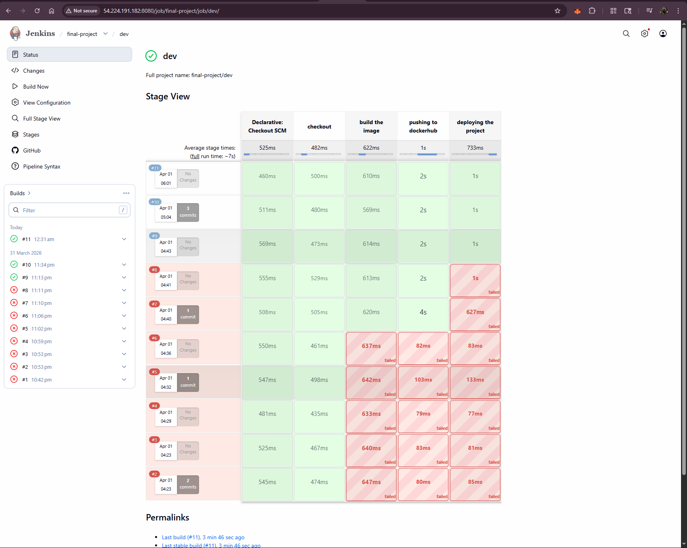

  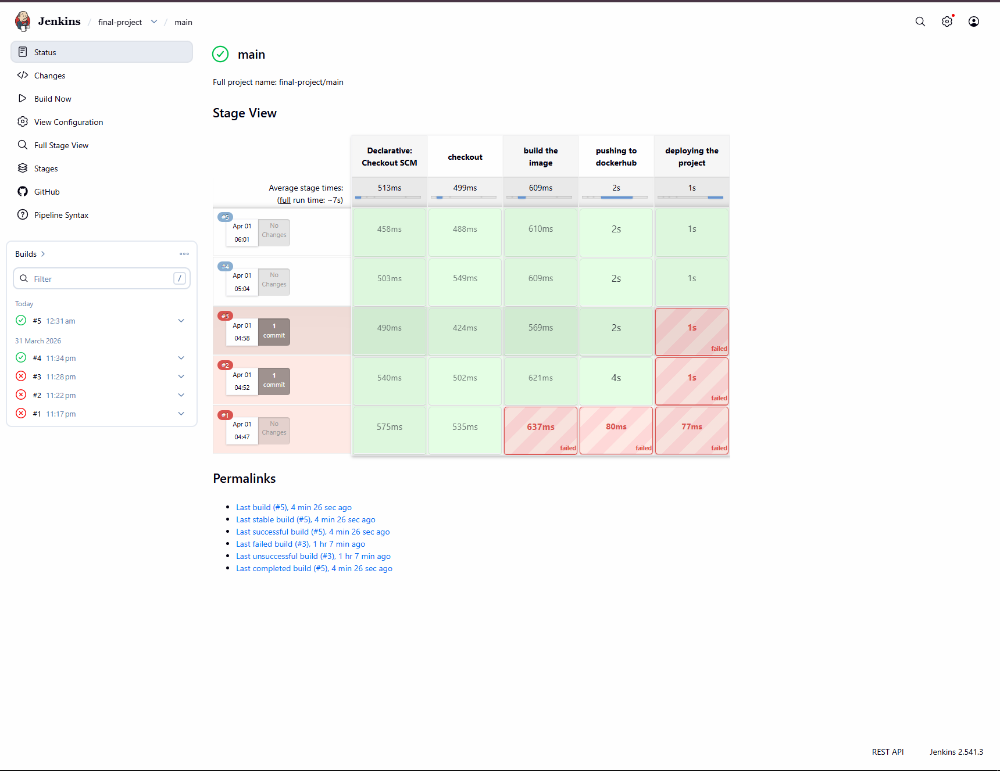
* Console output
  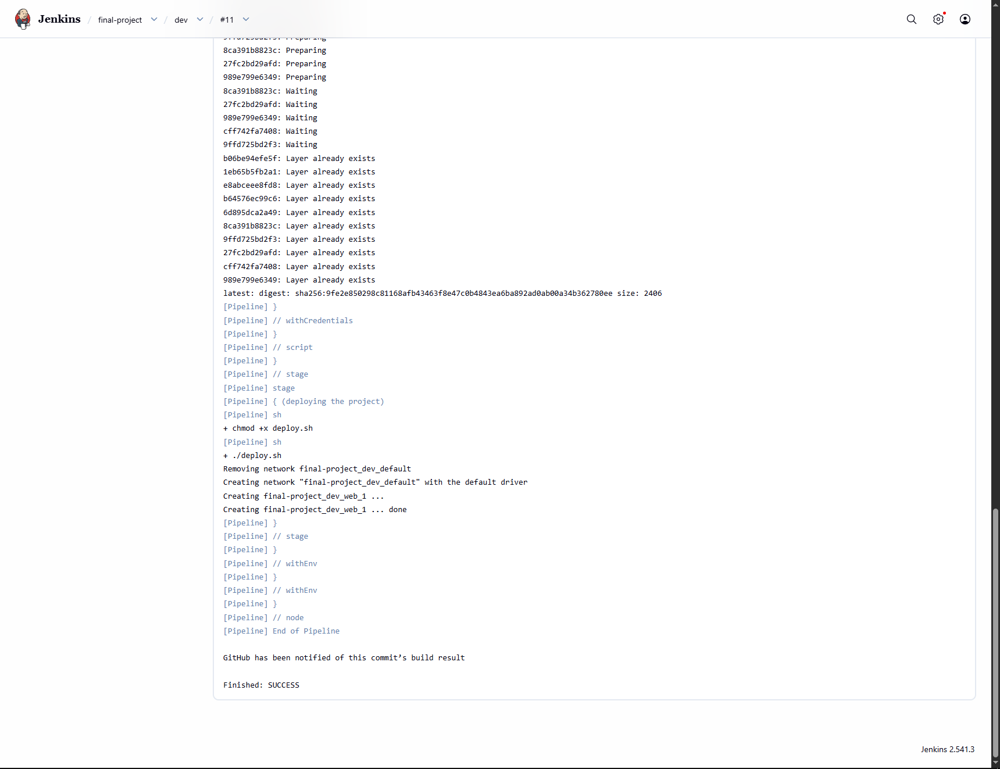

  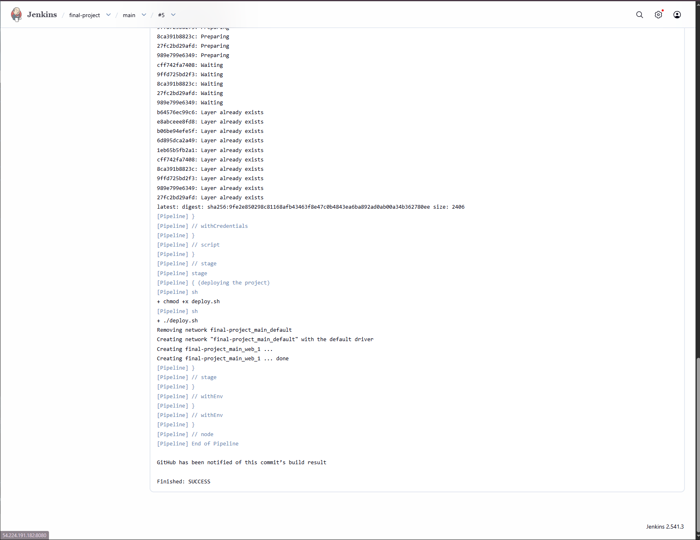

### ✅ AWS EC2

* Instance running
  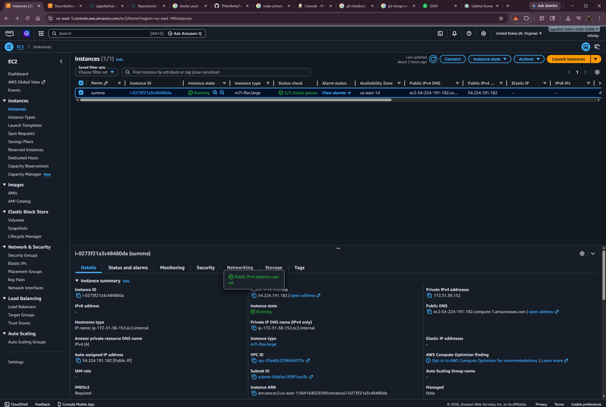
* Security group rules
  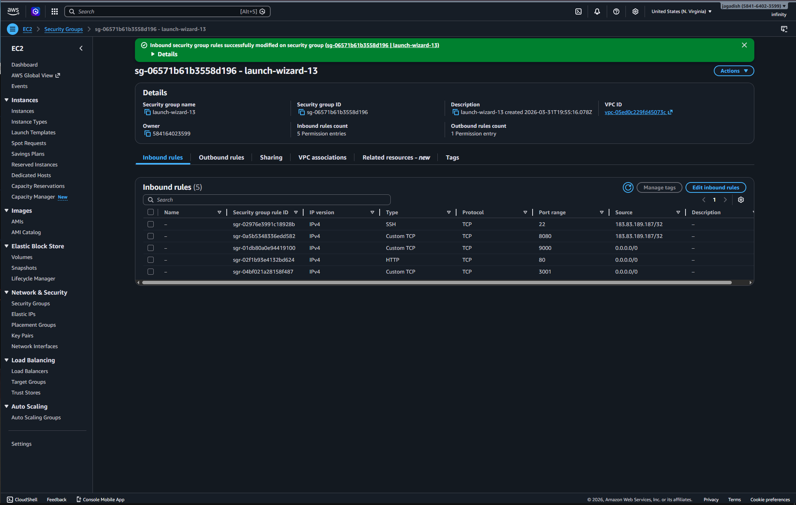

### ✅ DockerHub

* Image repositories
  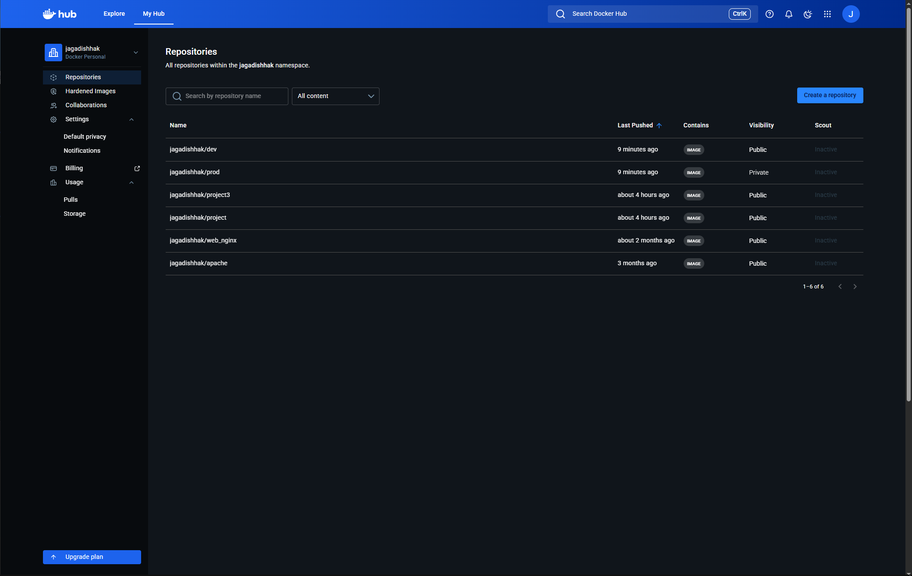
  
* Tags (dev/prod)
  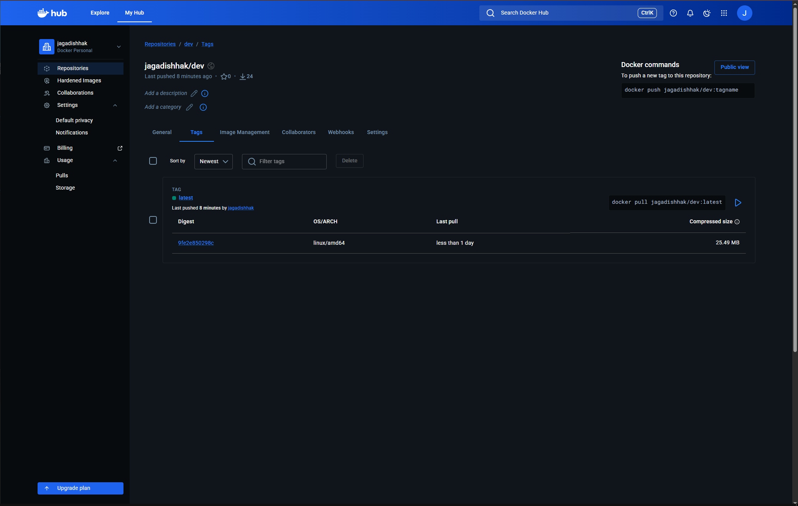

  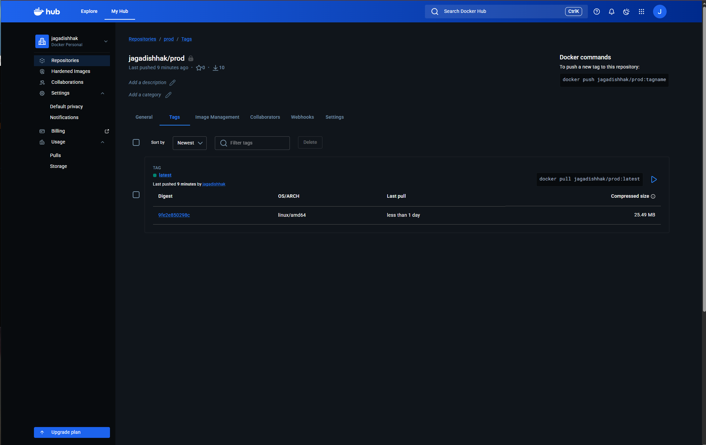

### ✅ Application

* Running on browser (EC2 IP : 54.224.191.182)
  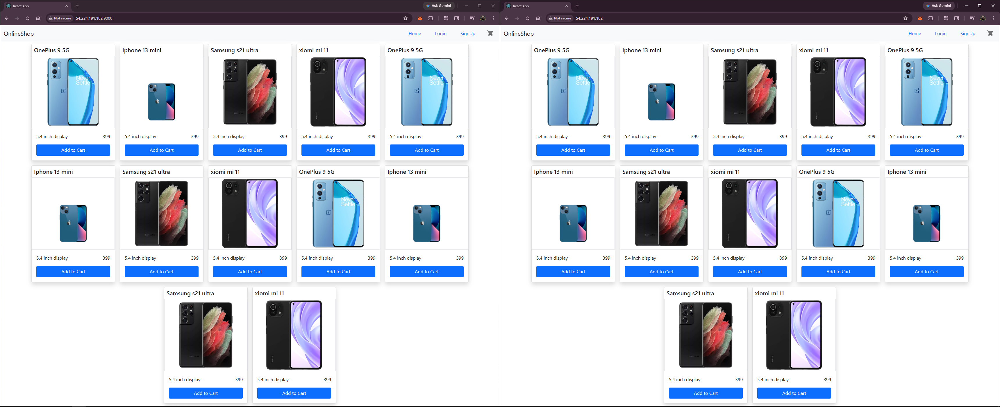

### ✅ Monitoring

* Uptime Kuma dashboard
  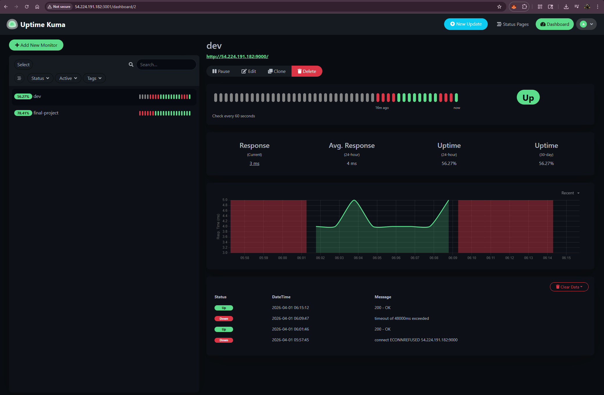

  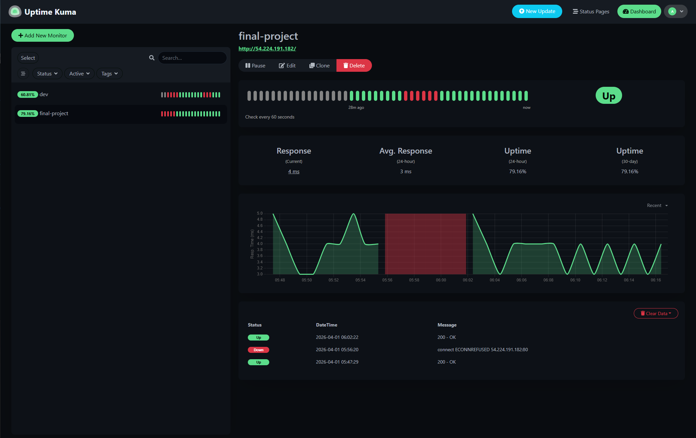
* Alert notification (Email)
  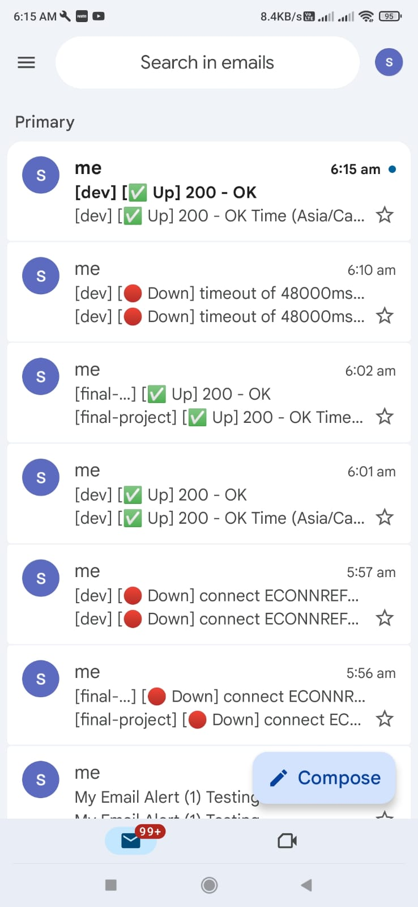

---

## ❗ Challenges Faced

* Jenkins not triggering from GitHub webhook
* DockerHub authentication error
* Port 80 already in use
* Missing build folder in Docker image
* Prometheus metrics confusion
* Monitoring setup issues

---

## 💡 Key Learnings

* CI/CD pipeline automation using Jenkins
* Docker image creation and deployment
* AWS EC2 setup and configuration
* Debugging real-world DevOps issues
* Monitoring using Uptime Kuma

---

## 💬 Conclusion

This project demonstrates a complete **DevOps lifecycle** from code commit to deployment and monitoring, ensuring automation, reliability, and high availability of applications.

---

## 👨‍💻 Author

**Jagadish V**
DevOps Engineer (Fresher)
Chennai, India 🇮🇳

---

